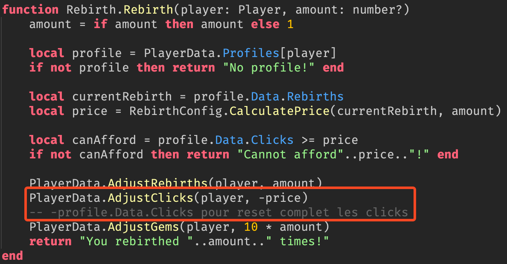

= S5.A.01 - Développement avancé
:icons: font
:models: models
:experimental:
:incremental:
:toc: macro
:toclevels: 3
:toc-title: Table des matières
:window: _blank
:correction!:

ifndef::env-github[:icons: font]
// Specific to GitHub
ifdef::env-github[]
:correction:
:caution-caption: :fire:
:important-caption: :exclamation:
:note-caption: :paperclip:
:tip-caption: :bulb:
:warning-caption: :warning:
:icongit: Git
endif::[]

toc::[]

== Réalisations

TIP: Vous trouverez ici toutes les informations nécessaires pour utiliser notre application ou site web, y compris comment y accéder, où trouver les documents, etc.

WARNING: Le contenu de ce dépôt et de ce ReadMe changeront tout au long de la durée du projet 

== Documentation utilisateur 

[cols="2,3,5",options=header]
|===
| Endroit | Code  | Notes 
| `ReplicatedStorage>Configs>Rebirths` | Configuration de Base (RebirthsConfig) | 
BasePrice: Prix de base pour une réincarnation. +
ExponentialFactor: Facteur pour augmenter le prix de manière exponentielle. +
CalculatePrice: Calcule le prix total pour un nombre spécifié de réincarnations. +
HasButtonsUnlocked: Vérifie si un joueur a débloqué un bouton de réincarnation spécifique.

| `ServerScriptService>Rebirth` | Dans la fonction Rebirth.Rebirth(player: Player, amount: number?) | PlayerData.AdjustClicks(player -price): Soustrait le prix de la "rebirth" au nombre de Clicks du joueur. Modifier avec PlayerData.AdjustClicks(player -profile.Data.Clicks) pour reset les Clicks du joueur quand il rebirth.
|===

ifdef::env-github[]
++++

  

++++
endif::[]

ifndef::env-github[]
.Ceci est la légende de l'image qui se rapporte au tableau ci-dessus

endif::[]