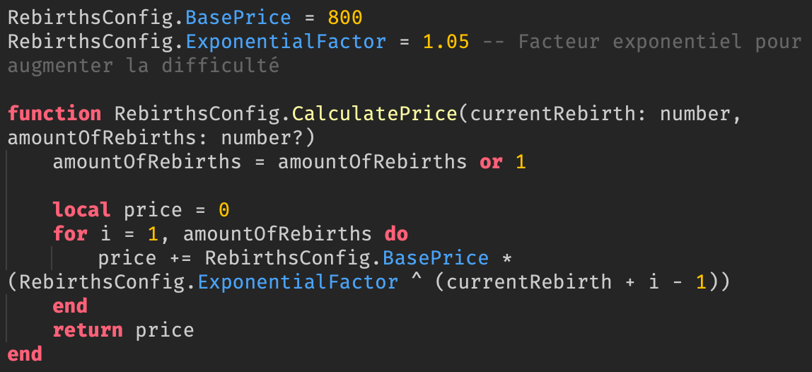
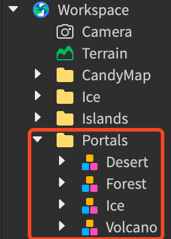
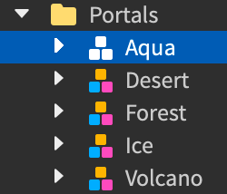
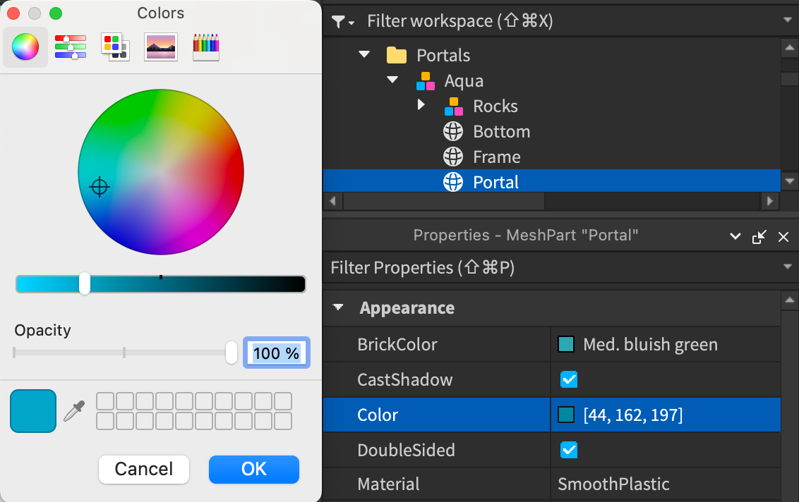
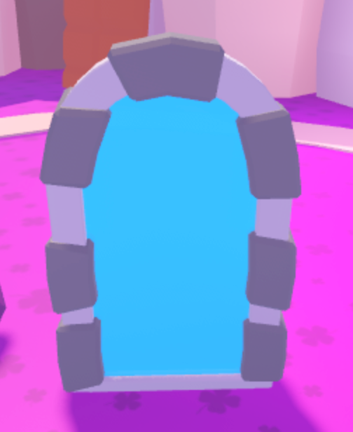
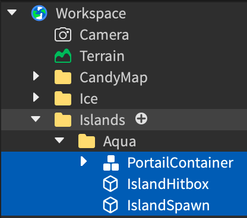
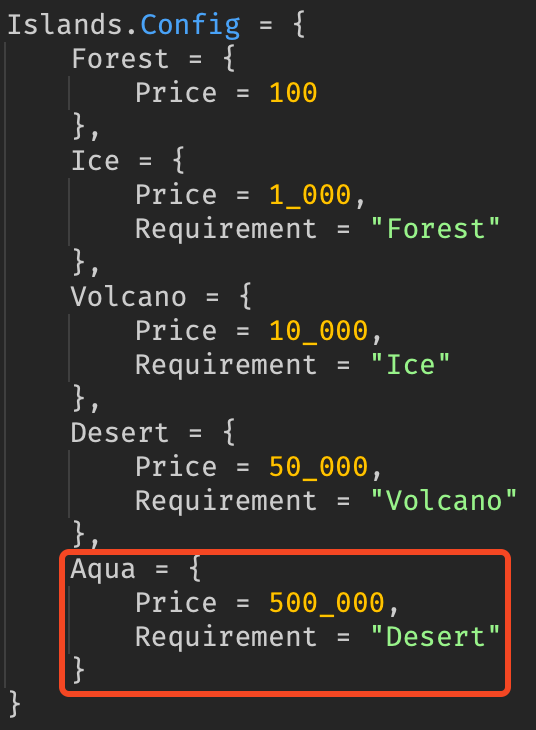

= Click-It Project Notes (FR)
:icons: font
:models: models
:experimental:
:incremental:
:toc: macro
:toclevels: 3
:toc-title: Table des matières
:window: _blank
:correction!:

ifndef::env-github[:icons: font]
// Specific to GitHub
ifdef::env-github[]
:correction:
:caution-caption: :fire:
:important-caption: :exclamation:
:note-caption: :paperclip:
:tip-caption: :bulb:
:warning-caption: :warning:
:icongit: Git
endif::[]

toc::[]

== Réalisations

TIP: Vous trouverez ici toutes les notes du projet Click-It.

WARNING: Ce projet est en cours de développement, il est donc possible que certaines informations soient manquantes ou erronées.

== Notes Roblox

=== Configuration des prix des Rebirths

[cols="2,3,5",options=header]
|===
| Endroit | Code  | Notes 
| `ReplicatedStorage>Configs>Rebirths` | Configuration de Base (RebirthsConfig) | 
BasePrice: Prix de base pour une réincarnation. +
ExponentialFactor: Facteur pour augmenter le prix de manière exponentielle. +
CalculatePrice: Calcule le prix total pour un nombre spécifié de réincarnations. +
HasButtonsUnlocked: Vérifie si un joueur a débloqué un bouton de réincarnation spécifique.
|===

ifdef::env-github[]
++++

  
  
Image méthode RebirthsConfig.CalculatePrice

++++
endif::[]

ifndef::env-github[]
.Image méthode RebirthsConfig.CalculatePrice

endif::[]

=== Ajuster le nombre de Clicks du joueur après une Rebirth

[cols="2,3,5",options=header]
|===
| Endroit | Code  | Notes
| `ServerScriptService>Rebirth` | Dans la fonction Rebirth.Rebirth(player: Player, amount: number?) | PlayerData.AdjustClicks(player -price): Soustrait le prix de la "rebirth" au nombre de Clicks du joueur. Modifier avec PlayerData.AdjustClicks(player -profile.Data.Clicks) pour reset les Clicks du joueur quand il rebirth.
|===

ifdef::env-github[]
++++

  
  
Image méthode Rebirth.Rebirth

++++
endif::[]

ifndef::env-github[]
.Image méthode Rebirth.Rebirth
image::images/test.png[Code Rebirth, align=center]
endif::[]

=== Ajouter un portail

Tout d'abord, copiez un modèle de Portail se trouvant dans Workspace>Portals :

ifdef::env-github[]
++++

  
  
Config des dossiers

++++
endif::[]

ifndef::env-github[]
.Config des dossiers

endif::[]

Puis le copier dans ce même dossier, et le renommer avec le nom du portail (ex: Aqua).

ifdef::env-github[]
++++

  
  
Ajout Portail

++++
endif::[]

ifndef::env-github[]
.Ajout Portail

endif::[]

Pensez aussi à changer la couleur du `Portal`.

ifdef::env-github[]
++++

  
  
Changement couleur du portail

++++
endif::[]

ifndef::env-github[]
.Changement couleur du portail

endif::[]

Et à déplacer le nouveau portail dans la map de départ (ou bien dans une autre map).

ifdef::env-github[]
++++

  
  
Placement du portail

++++
endif::[]

ifndef::env-github[]
.Placement du portail

endif::[]

Puis ajouter la nouvelle map dans le dossier `Workspace>Islands`, à noter qu'il faut que la nouvelle map contienne :

* Un portail "retour" intitulé `PortailContainer` (pour revenir au point de départ).
* Une Part intitulée `IslandHitbox` (servant à afficher le popup quand le joueur débloque l'île).
* Une Part intitulée `IslandSpawn` (qui sera l'endroit exact où le joueur sera téléporter lorsqu'il prendra le portail).

ifdef::env-github[]
++++

  
  
Config Islands

++++
endif::[]

ifndef::env-github[]
.Config Islands

endif::[]

Enfin il faut ajouter la nouvelle map dans le dossier `ReplicatedStorage>Configs>Islands` en y précisant :

* Le nom de la map (ex: Aqua).
* Le prix de l'île. (ex: 500_000)
* L'île nécéssaire pour débloquer l'île. (ex: Desert)

ifdef::env-github[]
++++

  
  
Code Config Islands

++++
endif::[]

ifndef::env-github[]
.Code Config Islands

endif::[]